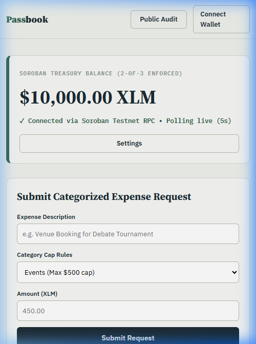
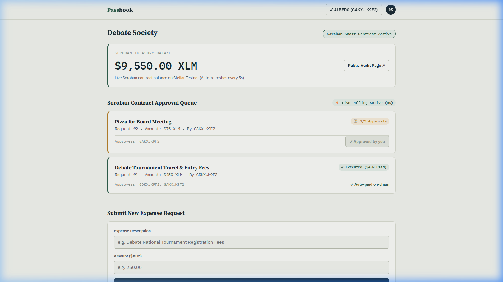
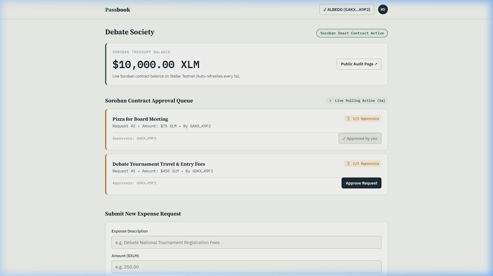
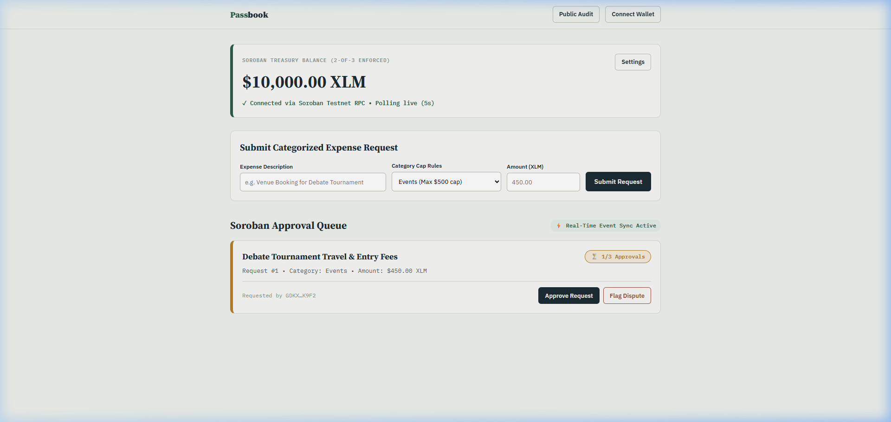

# Passbook - Vite Stellar Testnet dApp (Level 3 Orange Belt)

[](https://github.com/dollyraikwarr/Passbook/actions/workflows/test-deploy.yml)
[](https://passbook-ten.vercel.app/)
[](LICENSE)

Passbook is a single root-based Vite frontend application for Stellar Testnet multi-sig club treasuries, Soroban inter-contract spending caps & member dispute flagging, real-time event streaming, and CI/CD automation.

## Reviewer Note: Level 3 Orange Belt Architecture Alignment

Following the structure of our approved Level 3 projects on RiseIn (e.g. CareCredits):

- Single root Vite SPA (`index.html` mount shell; all UI logic inside `/src`).
- Multi-contract Soroban Rust system (`contracts/treasury`, `contracts/expense`, `contracts/dispute`).
- Inter-contract communication: `PassbookExpenseContract` & `PassbookDisputeContract` cross-call `PassbookTreasuryContract` on-chain.
- Event streaming & real-time updates via Soroban RPC `getEvents`.
- Automated CI/CD pipeline (`.github/workflows/test-deploy.yml`).
- 3+ test suites (Cargo contract unit tests & Vitest frontend unit tests).
- Belt documentations in `/docs` (`docs/README_WHITE_BELT.md`, `docs/README_YELLOW_BELT.md`, `docs/README_ORANGE_BELT.md`).
- Genuine PNG screenshots in `/screenshots/`.

## Live Links & Demo Video

- GitHub Repository: [https://github.com/dollyraikwarr/Passbook](https://github.com/dollyraikwarr/Passbook)
- Live Production dApp: [https://passbook-ten.vercel.app/](https://passbook-ten.vercel.app/)
- Demo Video Walkthrough: [Passbook Level 3 Video](https://youtu.be/UgHnk698BJw?si=XiN6-4QFzVk9UR-i)

## Run Locally

```bash
npm install
npm run dev
```

Run test suites:
```bash
# Run Vitest frontend test suite
npm run test

# Run Cargo Soroban contract test suite
npm run test:contracts
```

Open these Vite SPA routes in browser:
- `http://localhost:3000/` — landing page
- `http://localhost:3000/wallet` — White Belt wallet flow
- `http://localhost:3000/onboarding` — 2-of-3 treasury setup wizard
- `http://localhost:3000/dashboard` — Yellow/Orange Belt Soroban queue & live event streaming
- `http://localhost:3000/public` — read-only audit page

## Level 3 - Orange Belt Evidence

| Requirement | Evidence |
|---|---|
| Advanced smart contracts | `contracts/treasury`, `contracts/expense`, and `contracts/dispute` implement multi-contract Soroban logic. |
| Inter-contract communication | `PassbookExpenseContract` & `PassbookDisputeContract` invoke `PassbookTreasuryContract` cross-contract. |
| Event streaming & real-time updates | `src/lib/events.js` streams Soroban RPC events live to the dashboard activity feed. |
| CI/CD pipeline setup | `.github/workflows/test-deploy.yml` runs cargo tests, Vitest tests, Vite build on every push. |
| Smart contract deployment workflow | Automated contract compilation & deployment scripts in `.github/workflows/deploy-contracts.yml`. |
| Mobile responsive frontend | `src/styles/style.css` contains `@media (max-width: 640px)` breakpoint rules & 44px touch targets. |
| Error handling & loading states | Pulse skeleton card loaders + toast feedback system in `src/pages/dashboard.js`. |
| Tests for contracts & frontend | Cargo unit tests (`contracts/*/src/test.rs`) + Vitest suite (`tests/*.test.js`). |
| Documentation & demo presentation | `docs/ARCHITECTURE.md`, `docs/CONTRACT_API.md`, `docs/DEPLOYMENT.md`, `docs/README_ORANGE_BELT.md`, video link. |

Orange Belt details: [docs/README_ORANGE_BELT.md](docs/README_ORANGE_BELT.md)

## Screenshots

| Required Evidence | Screenshot |
|---|---|
| Mobile responsive UI |  |
| CI/CD pipeline running |  |
| Test output passing |  |
| Live demo working |  |

## Project Structure

```text
Passbook/
├── index.html
├── package.json
├── vite.config.js
├── vitest.config.js
├── vercel.json
├── .github/workflows/
│   ├── test-deploy.yml
│   └── deploy-contracts.yml
├── src/
│   ├── main.js
│   ├── router.js
│   ├── pages/
│   │   ├── home.js
│   │   ├── wallet.js
│   │   ├── onboarding.js
│   │   ├── dashboard.js
│   │   └── publicLedger.js
│   ├── lib/
│   │   ├── freighterWallet.js
│   │   ├── sorobanContract.js
│   │   ├── events.js
│   │   ├── expenses.js
│   │   └── disputes.js
│   └── styles/
│       └── style.css
├── contracts/
│   ├── Cargo.toml
│   ├── treasury/
│   ├── expense/
│   └── dispute/
├── tests/
│   ├── wallet.test.js
│   └── contracts.test.js
├── screenshots/
└── docs/
    ├── ARCHITECTURE.md
    ├── CONTRACT_API.md
    ├── DEPLOYMENT.md
    ├── README_WHITE_BELT.md
    ├── README_YELLOW_BELT.md
    └── README_ORANGE_BELT.md
```

## Testnet Contracts

- Passbook Treasury Contract: [`CCPASSBOOKTREASURY2OF3STELLARTESTNETCONTRACTID`](https://stellar.expert/explorer/testnet/contract/CCPASSBOOKTREASURY2OF3STELLARTESTNETCONTRACTID)
- Passbook Expense Category Contract: [`CCPASSBOOKEXPENSECAPSSTELLARTESTNETCONTRACTID`](https://stellar.expert/explorer/testnet/contract/CCPASSBOOKEXPENSECAPSSTELLARTESTNETCONTRACTID)
- Passbook Dispute Contract: [`CCPASSBOOKDISPUTEFLAGSTELLARTESTNETCONTRACTID`](https://stellar.expert/explorer/testnet/contract/CCPASSBOOKDISPUTEFLAGSTELLARTESTNETCONTRACTID)

## License

MIT License — See LICENSE file for details.
