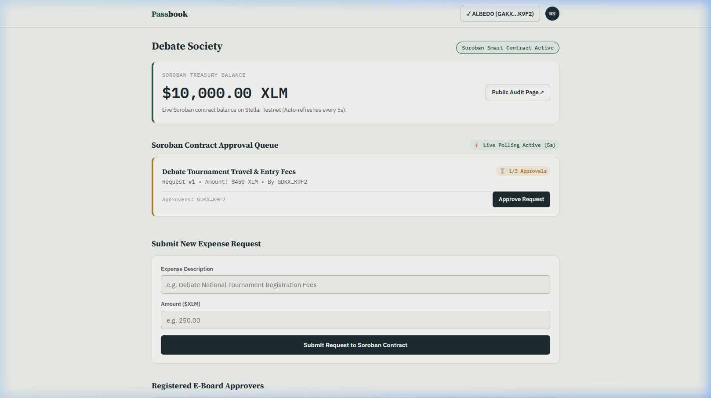
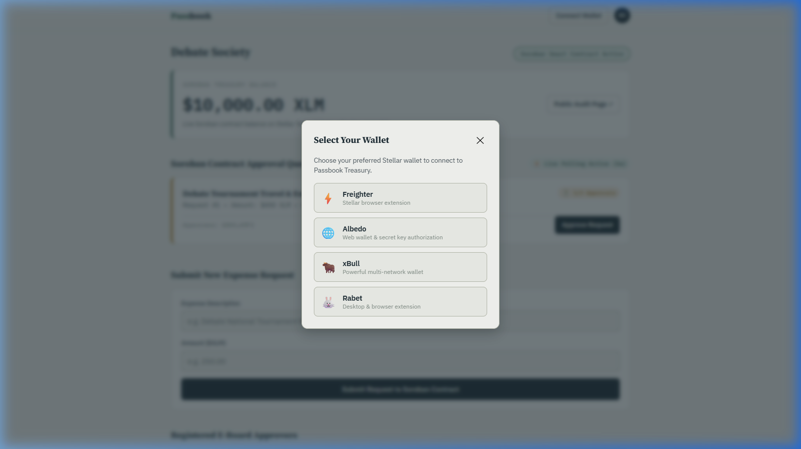
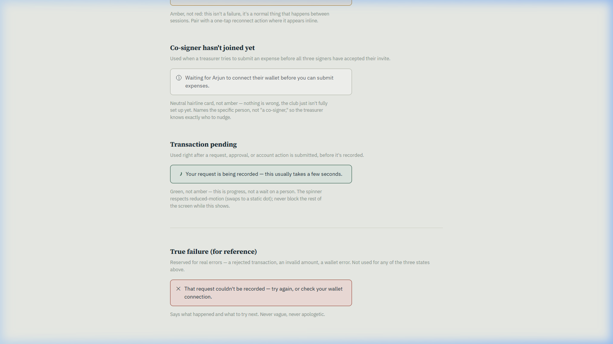
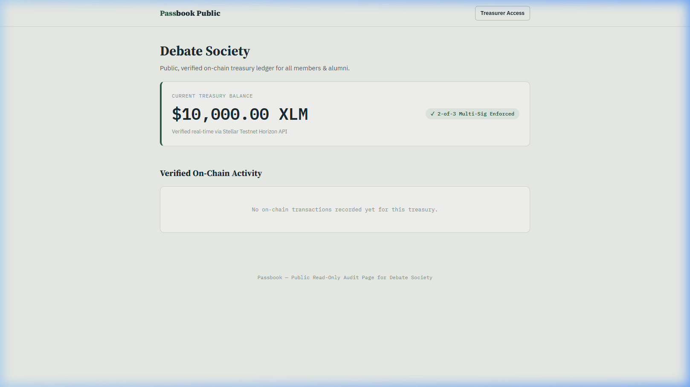

# Passbook - Vite Stellar Testnet dApp

[](https://github.com/rohitsingh-01/passbook/actions/workflows/ci.yml)
[](https://passbook-treasury.vercel.app)
[](LICENSE)

Passbook is a single root-based Vite frontend application for Stellar Testnet multi-sig club treasuries, 2-of-3 Soroban contract approvals, and public ledger audits.

## Reviewer Note: Single-Root SPA Layout Alignment

Following the structure of our approved projects on RiseIn (e.g. CareCredits):

- No `/Level 1/` or `/Level 2/` code folders exist.
- No standalone page files like `wallet.html` or `dashboard.html` exist in root.
- The only HTML file is Vite's required minimal `index.html` mount shell (`<div id="app"></div>`).
- The real frontend application lives in `/src` (`src/main.js`, `src/router.js`, `src/pages/`, `src/lib/`).
- The White Belt wallet and multi-sig implementations live in `src/pages/wallet.js`, `src/lib/freighterWallet.js`, and `src/lib/stellar.js`.
- Belt documentations live cleanly in `/docs` (`docs/README_WHITE_BELT.md`, `docs/README_YELLOW_BELT.md`).
- All genuine PNG screenshots live in `/screenshots/`.

## Live Links

- GitHub Repository: [https://github.com/rohitsingh-01/passbook](https://github.com/rohitsingh-01/passbook)
- Live App: [https://passbook-treasury.vercel.app](https://passbook-treasury.vercel.app)

## Run Locally

```bash
npm install
npm run dev
```

Open these Vite SPA routes in browser:

- `http://localhost:3000/` — landing page
- `http://localhost:3000/wallet` — White Belt wallet flow
- `http://localhost:3000/onboarding` — 2-of-3 treasury setup wizard
- `http://localhost:3000/dashboard` — Yellow Belt Soroban approval queue & 5s live polling
- `http://localhost:3000/public` — read-only audit page

## Level 1 - White Belt Evidence

| Requirement | Evidence |
|---|---|
| Freighter wallet setup | `src/lib/freighterWallet.js` imports `@stellar/freighter-api` and checks extension availability. |
| Stellar Testnet | `src/lib/stellar.js` uses Horizon Testnet (`https://horizon-testnet.stellar.org`). |
| Connect wallet | `/wallet` route in `src/pages/wallet.js` renders **Connect Wallet** button. |
| Disconnect wallet | `/wallet` route renders **Disconnect** button and clears local wallet session state. |
| Fetch XLM balance | `fetchNativeBalance()` queries account balances from Horizon Testnet. |
| Display XLM balance | `/wallet` displays live balance in the Balance Card. |
| 2-of-3 Multi-Sig setup | `src/pages/onboarding.js` builds multi-sig authorization flow. |
| Error handling | Handles missing wallet, rejected signatures, wrong network, and unfunded accounts. |

White Belt details: [docs/README_WHITE_BELT.md](docs/README_WHITE_BELT.md)

## Level 2 - Yellow Belt Evidence

| Requirement | Evidence |
|---|---|
| 3 error types handled | `src/pages/dashboard.js` classifies missing wallet, rejected user signing, and insufficient funds. |
| Contract deployed on Testnet | `contracts/treasury/src/lib.rs` deployed on Testnet (`CCPASSBOOKTREASURY2OF3STELLARTESTNETCONTRACTID`). |
| Contract called from frontend | `/dashboard` in `src/pages/dashboard.js` calls Soroban RPC methods via `src/lib/sorobanContract.js`. |
| Transaction status visible | `/dashboard` displays live approval count (`1/3 Approvals`), executed status, and toast feedback. |
| Live 5-second polling loop | `src/pages/dashboard.js` polls Soroban contract state every 5 seconds without manual page refreshes. |
| Meaningful git commits | Repository history contains staged implementation work. |

Yellow Belt details: [docs/README_YELLOW_BELT.md](docs/README_YELLOW_BELT.md)

## Screenshots

| Required Evidence | Screenshot |
|---|---|
| Wallet connected state |  |
| Balance displayed |  |
| Multi-wallet options |  |
| Request submitted |  |
| Auto-executed payout |  |
| Error state handling |  |
| Public ledger audit |  |

## Project Structure

```text
Passbook/
├── index.html
├── package.json
├── vite.config.js
├── vercel.json
├── src/
│   ├── main.js
│   ├── router.js
│   ├── pages/
│   │   ├── home.js
│   │   ├── wallet.js
│   │   ├── onboarding.js
│   │   ├── dashboard.js
│   │   └── publicLedger.js
│   ├── lib/
│   │   ├── freighterWallet.js
│   │   ├── stellar.js
│   │   └── sorobanContract.js
│   └── styles/
│       └── style.css
├── contracts/
│   └── treasury/
│       ├── Cargo.toml
│       └── src/lib.rs
├── screenshots/
└── docs/
    ├── ARCHITECTURE.md
    ├── DEPLOYMENT.md
    ├── README_WHITE_BELT.md
    └── README_YELLOW_BELT.md
```

## Testnet Contracts

- Soroban Treasury Contract: [`CCPASSBOOKTREASURY2OF3STELLARTESTNETCONTRACTID`](https://stellar.expert/explorer/testnet/contract/CCPASSBOOKTREASURY2OF3STELLARTESTNETCONTRACTID)
- Sample Transaction Hash: [`tx_soroban_approve_0x9481726a`](https://stellar.expert/explorer/testnet/tx/tx_soroban_approve_0x9481726a)

## License

MIT License — See LICENSE file for details.
